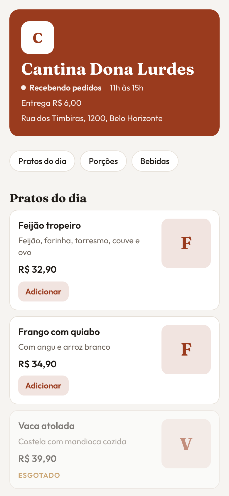
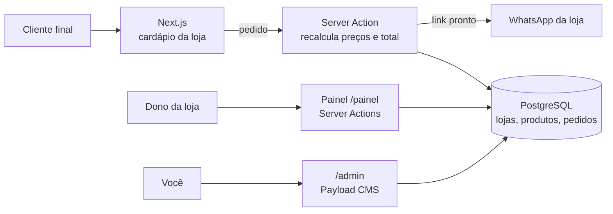

# Cardápio online

Cardápio e catálogo online para restaurantes e comércios. O cliente final monta o pedido no celular e finaliza no site; a loja recebe no painel e o cliente acompanha pelo WhatsApp. Cada loja é só um cadastro no painel: nome, cores, fonte, WhatsApp, horário e produtos, sem mexer no código.

| Cardápio | Pedido |
|---|---|
|  |  |

## O que já funciona

- **Várias lojas num sistema só.** Cada loja tem o próprio endereço: `/nome-da-loja`.
- **Visual por loja:** cor principal e fonte dos títulos escolhidas no painel.
- **Cardápio público** com categorias, foto, preço e produto esgotado.
- **Pedido no site:** carrinho, entrega ou retirada, cadastro pelo telefone (vale em todas as lojas), forma de pagamento, troco e CPF na nota. O pedido aparece no painel com número e status, e o cliente tem um botão para acompanhar pelo WhatsApp.
- **Painel da loja** (`/painel`): tela simples, feita para o celular, onde o dono cuida de produtos (com foto e "esgotado" num toque), categorias, dados da loja (com prévia do cardápio antes de salvar) e pedidos.
- **Pedidos de hoje** (`/painel`): os pedidos do dia em cartões, com pedido novo em destaque, troca de status em um toque (novo, preparando, pronto, entregue ou cancelado) e atualização sozinha a cada 20 segundos. Feita para usar no celular.
- **Importar produtos por planilha** (`/painel/importar`): CSV ou Excel com nome, preço e categoria. Mostra uma prévia com o que vai ser criado ou atualizado e as linhas com erro antes de salvar.
- **`/admin` (Payload):** só para você, administrador: criar lojas e usuários. O dono de uma loja só vê e edita a dele, pelo `/painel`.

## Dois modelos de venda, o mesmo código

| | Assinatura | Venda do sistema |
|---|---|---|
| Onde roda | Esta instalação, com várias lojas | Uma instalação só do cliente |
| Endereço | Seu domínio (`/nome-da-loja`) | Domínio do cliente |
| Cobrança | Implantação + mensalidade | Valor único + manutenção opcional |

## Cadastrar um cliente novo

Passo a passo em [docs/novo-cliente.md](docs/novo-cliente.md): criar a loja, o login do dono, importar os produtos e conferir o cardápio.

## Como funciona



- O navegador manda só "qual produto e quantos". Preço, taxa e total são recalculados no servidor com os dados do banco.
- O isolamento entre lojas vem do plugin oficial de multi-cliente do Payload: todo produto, categoria, pedido e imagem tem um campo "loja".
- Pedidos têm limite por hora em cada loja, contra robôs.

## Estrutura do código

```
src/
├── app/(frontend)/   # Cardápio público (/[loja]), pedido (actions.ts) e painel da loja (/painel)
├── app/(payload)/    # Painel /admin e API, gerados pelo Payload
├── collections/      # Tabelas: lojas, categorias, produtos, pedidos, imagens, usuários
├── components/       # Cardápio e carrinho; components/painel: telas do painel da loja
├── lib/              # Regras pequenas e testadas: pedido, planilha, tema, WhatsApp
└── seed/             # Loja de demonstração (Cantina Dona Lurdes)
tests/int/            # Testes das regras do pedido e do WhatsApp
```

<details>
<summary>Rodar no computador (para desenvolvimento)</summary>

Precisa de Node.js 22, pnpm 10 e um banco PostgreSQL (`docker compose up -d db` sobe um local).

```bash
pnpm install
cp .env.example .env   # preencha DATABASE_URL, PAYLOAD_SECRET e o login do seed
pnpm payload migrate   # cria as tabelas
pnpm seed              # cria o administrador e a loja de demonstração
pnpm dev               # abre em http://localhost:3000/cantina-dona-lurdes
```

Painel: http://localhost:3000/admin, com o e-mail e a senha do seed.

</details>
