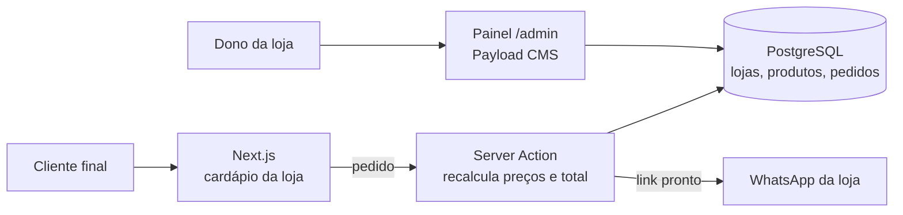

# Cardápio online

Cardápio e catálogo online para restaurantes e comércios. O cliente final monta o pedido no celular e envia pronto para o WhatsApp da loja. Cada loja é só um cadastro no painel: nome, cores, fonte, WhatsApp, horário e produtos, sem mexer no código.

| Cardápio | Pedido |
|---|---|
|  |  |

## O que já funciona

- **Várias lojas num sistema só.** Cada loja tem o próprio endereço: `/nome-da-loja`.
- **Visual por loja:** cor principal e fonte dos títulos escolhidas no painel.
- **Cardápio público** com categorias, foto, preço e produto esgotado.
- **Pedido pelo WhatsApp:** carrinho, entrega ou retirada, nome, endereço e observações. O pedido fica salvo no painel com número e status.
- **Importar produtos por planilha** (`/admin/importar`): CSV ou Excel com nome, preço e categoria. Mostra uma prévia com o que vai ser criado ou atualizado e as linhas com erro antes de salvar.
- **Painel em `/admin`:** você (administrador) vê todas as lojas; o dono de uma loja só vê e edita a dele.

## Dois modelos de venda, o mesmo código

| | Assinatura | Venda do sistema |
|---|---|---|
| Onde roda | Esta instalação, com várias lojas | Uma instalação só do cliente |
| Endereço | Seu domínio (`/nome-da-loja`) | Domínio do cliente |
| Cobrança | Implantação + mensalidade | Valor único + manutenção opcional |

## Cadastrar um cliente novo

Passo a passo em [docs/novo-cliente.md](docs/novo-cliente.md): criar a loja, o login do dono, importar os produtos e conferir o cardápio.

## Como funciona



- O navegador manda só "qual produto e quantos". Preço, taxa e total são recalculados no servidor com os dados do banco.
- O isolamento entre lojas vem do plugin oficial de multi-cliente do Payload: todo produto, categoria, pedido e imagem tem um campo "loja".
- Pedidos têm limite por hora em cada loja, contra robôs.

## Estrutura do código

```
src/
├── app/(frontend)/   # Cardápio público (/[loja]) e criação do pedido (actions.ts)
├── app/(payload)/    # Painel /admin e API, gerados pelo Payload
├── collections/      # Tabelas: lojas, categorias, produtos, pedidos, imagens, usuários
├── components/       # Cardápio, carrinho e telas extras do /admin (importação)
├── lib/              # Regras pequenas e testadas: pedido, planilha, tema, WhatsApp
└── seed/             # Loja de demonstração (Cantina Dona Lurdes)
tests/int/            # Testes das regras do pedido e do WhatsApp
```

<details>
<summary>Rodar no computador (para desenvolvimento)</summary>

Precisa de Node.js 22, pnpm 10 e um banco PostgreSQL (`docker compose up -d db` sobe um local).

```bash
pnpm install
cp .env.example .env   # preencha DATABASE_URL, PAYLOAD_SECRET e o login do seed
pnpm payload migrate   # cria as tabelas
pnpm seed              # cria o administrador e a loja de demonstração
pnpm dev               # abre em http://localhost:3000/cantina-dona-lurdes
```

Painel: http://localhost:3000/admin, com o e-mail e a senha do seed.

</details>
